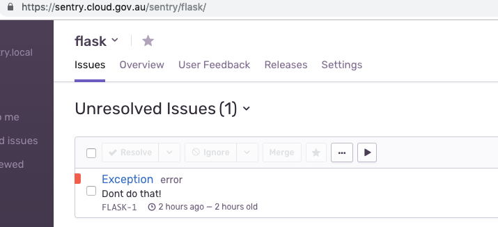

# Demo of Sentry on cloud.gov.au

This is a simple python flask application to demonstrate the use of [sentry](https://sentry.io).

It contains an endpoint at `/error` which raises an exception.

You will first need to [create a project in sentry](https://sentry.cloud.gov.au/organizations/dta/projects/new/), and have the `SENTRY_DSN` in your environment. If you use [direnv](https://direnv.net/) - run `cp .envrc.sample .envrc`, and add your DSN.

## 1. Run a flask application locally

```bash
docker build . --tag cga-sentry-demo
docker run --rm -p 5000:5000 cga-sentry-demo
```

You can now view it at http://localhost:5000

Observe that visiting http://localhost:5000/error shows the exception and stack trace in your terminal.

## 2. Run the application in cloud foundry

```bash
# If necessary, target your space
cf target -o myorg -s myspace

# Deploy the application in cloud foundry
cf push

# view the application in a browser
open "https://$(cf apps | grep sentry-demo | awk '{ print $6 }')"
```

You can view the app logs from cloud foundry by running `cf logs sentry-demo`. If you visit the `/error` endpoint you should see an error in the logs.

## Add sentry

```bash
# Add the SENTRY_DSN to your cf application
cf set-env sentry-demo SENTRY_DSN "${SENTRY_DSN}"

# View the changes needed to add sentry
sdiff hello.py hello-sentry.py

# Overwrite hello.py with the sentry code
cp hello-sentry.py hello.py

# Redeploy the application in cloud foundry
cf push

# Raise an exception in your application
open "https://$(cf apps | grep sentry-demo | awk '{ print $6 }')/error"
```

You should now see an error in sentry :tada:. Click on the error to see the information that sentry gives you.


